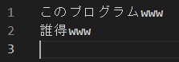

# laugh-maker

## これは何
日々の辛いことを記録すると末尾に草を自動的にはやすので後から読むとなんだか元気になれます(~~余計なお世話じゃ)~~

# 使い方
1. クローンします
2. `stack install` を入力
3. `stack build` を入力
4. プロジェクトのルートディレクトリで`stack runhaskell app/Main.hs` を入力
5. 日付を聞かれるので入力
6. 日々の辛いことを入力します...
7. 書き終えたら `Ctrl + D` で終了
8. filePlaceディレクトリに保存されてるので読んでください。適宜月ごとにまとめてください

## 例

